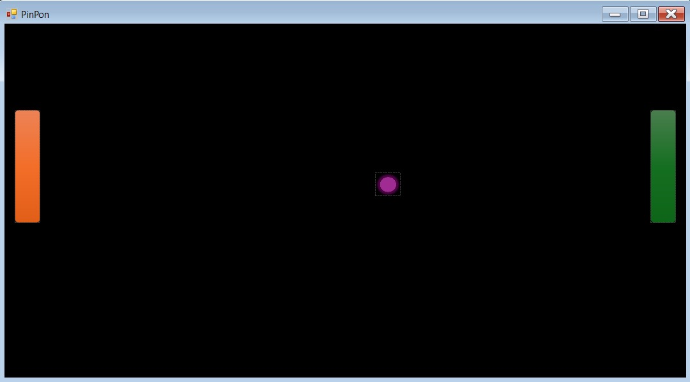

# Oyun Projesi

## Genel Bakış

Oyun Projesi'ne hoş geldiniz! Bu proje, beş eğlenceli mini oyunu içermektedir: T-Rex oyunu, Pin-Pong oyunu, Mario oyunu, At Yarışı oyunu ve Flappy Bird oyunu. Kullanıcılar giriş yapabilir, oyunları oynayabilir ve skorları kaydedilerek liderlik tablosunda görüntülenebilir.

## Özellikler

- **Kullanıcı Doğrulama**: Kullanıcılar kayıt olabilir ve giriş yapabilir.
- **T-Rex Oyunu**: T-Rex'in engellerin üzerinden atladığı klasik koşu oyunu.
- **Pin-Pong Oyunu**: Bilgisayara karşı oynanan eğlenceli bir pin-pong oyunu.
- **Mario Oyunu**: Mario platform oyunu.
- **At Yarışı Oyunu**: At yarışı simülasyonu.
- **Flappy Bird Oyunu**: Engeller arasında uçan kuş oyununu andıran eğlenceli bir oyun.
- **Liderlik Tablosu**: Tüm kullanıcıların en yüksek skorlarını gerçek zamanlı olarak görüntüler.

## Kullanılan Teknolojiler

- **C#**: Oyun mantığı için kullanılan ana programlama dili.
- **Windows Forms**: Grafik kullanıcı arayüzü için kullanılmıştır.
- **SQL Server**: Kullanıcı bilgilerini ve skorları depolamak için kullanılan veritabanı.

## Kurulum

### Gereksinimler

- .NET Framework
- SQL Server

### Adımlar

1. **Depoyu klonlayın:**

    ```sh
    git clone https://github.com/kullaniciadi/oyunprojesi.git
    cd oyunprojesi
    ```

2. **Projeyi açın:**

    Visual Studio'da çözüm dosyasını (`oyunprojesi.sln`) açın.

3. **Veritabanını kurun:**

    - SQL Server'da yeni bir veritabanı oluşturun.
    - Aşağıdaki SQL komutlarını çalıştırarak gerekli tabloları oluşturun:

    ```sql
    CREATE TABLE Kullanicilar (
        KullaniciID INT PRIMARY KEY IDENTITY(1,1),
        KullaniciAdi NVARCHAR(50) UNIQUE NOT NULL,
        Sifre NVARCHAR(256) NOT NULL,
        EPosta NVARCHAR(100) UNIQUE NOT NULL,
        KayitTarihi DATETIME DEFAULT GETDATE(),
        ToplamSkor INT DEFAULT 0
    );

    CREATE TABLE Oyunlar (
        OyunID INT PRIMARY KEY IDENTITY(1,1),
        OyunAdi NVARCHAR(100) NOT NULL
    );

    CREATE TABLE Skorlar (
        SkorID INT PRIMARY KEY IDENTITY(1,1),
        KullaniciID INT NOT NULL,
        OyunID INT NOT NULL,
        Skor INT NOT NULL,
        Tarih DATETIME DEFAULT GETDATE(),
        FOREIGN KEY (KullaniciID) REFERENCES Kullanicilar(KullaniciID),
        FOREIGN KEY (OyunID) REFERENCES Oyunlar(OyunID)
    );
    ```

4. **Bağlantı dizesini güncelleyin:**

    C# dosyalarınızda (`skortablosu.cs`, `giris.cs` vb.), `connectionString` değişkenini SQL Server yapılandırmanıza göre güncelleyin:

    ```csharp
    string connectionString = "Server=SUNUCU_ADI;Database=gaming;Integrated Security=True;";
    ```

5. **Projeyi derleyin ve çalıştırın:**

    - Visual Studio'da projeyi derleyin.
    - Uygulamayı çalıştırarak başlatın.

## Kullanım

- **Kayıt Ol**: Yeni bir kullanıcı hesabı oluşturun.
- **Giriş Yap**: Kullanıcı adı ve şifrenizle giriş yapın.
- **Oyun Oyna**: T-Rex, Pin-Pong, Mario, At Yarışı veya Flappy Bird oyunlarından birini seçin ve oynamaya başlayın.
- **Skorları Görüntüle**: Liderlik tablosunda tüm kullanıcıların en yüksek skorlarını kontrol edin.

## Ekran Görüntüleri


*Kullanıcıların bilgileriyle giriş yapabileceği giriş ekranı.*


*T-Rex oyunu oynanırken bir ekran görüntüsü.*



*Pin-Pong oyunu oynanırken bir ekran görüntüsü.*


*Mario oyunu oynanırken bir ekran görüntüsü.*


*At Yarışı oyunu oynanırken bir ekran görüntüsü.*


*Flappy Bird oyunu oynanırken bir ekran görüntüsü.*


*En yüksek skorları gösteren liderlik tablosu.*

## Katkıda Bulunma

Katkılar memnuniyetle karşılanır! Herhangi bir iyileştirme veya hata düzeltmesi için lütfen bir sorun (issue) açın veya bir çekme isteği (pull request) gönderin.

## İletişim

Herhangi bir soru veya görüş için lütfen (ysfecvtt@gmail.com) adresine e-posta gönderin.

---

İyi oyunlar!
